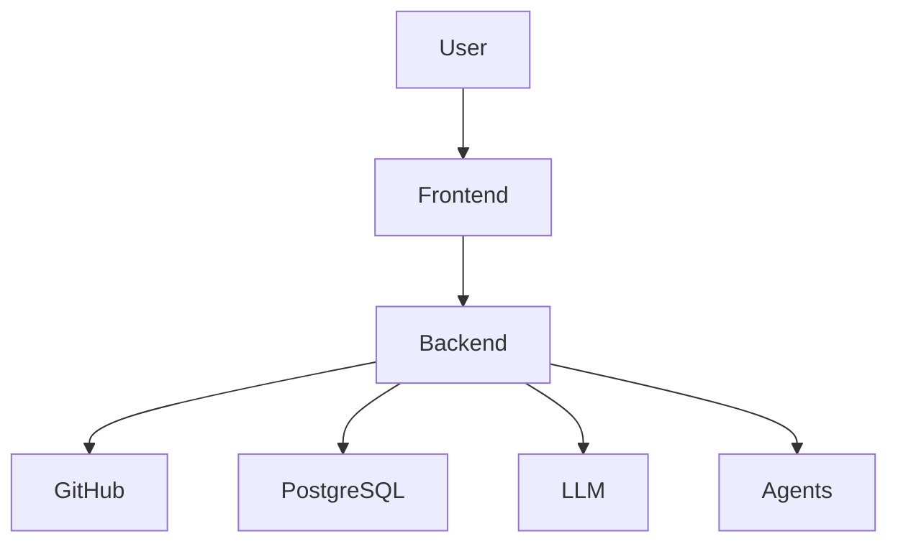

# System Design

DevMind AI 使用 Next.js 前端、FastAPI 后端、PostgreSQL/pgvector 数据层和自定义多 Agent 工作流。

```mermaid
flowchart TD
  User --> Frontend
  Frontend --> Backend
  Backend --> GitHub
  Backend --> PostgreSQL
  Backend --> LLM
  Backend --> Agents
```
